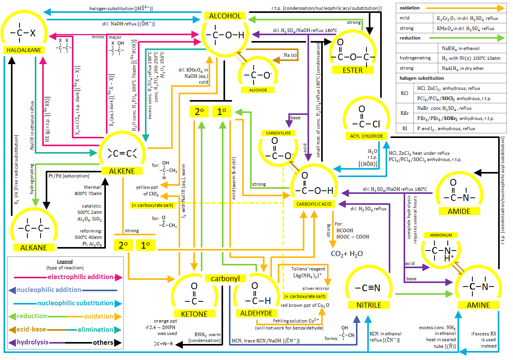
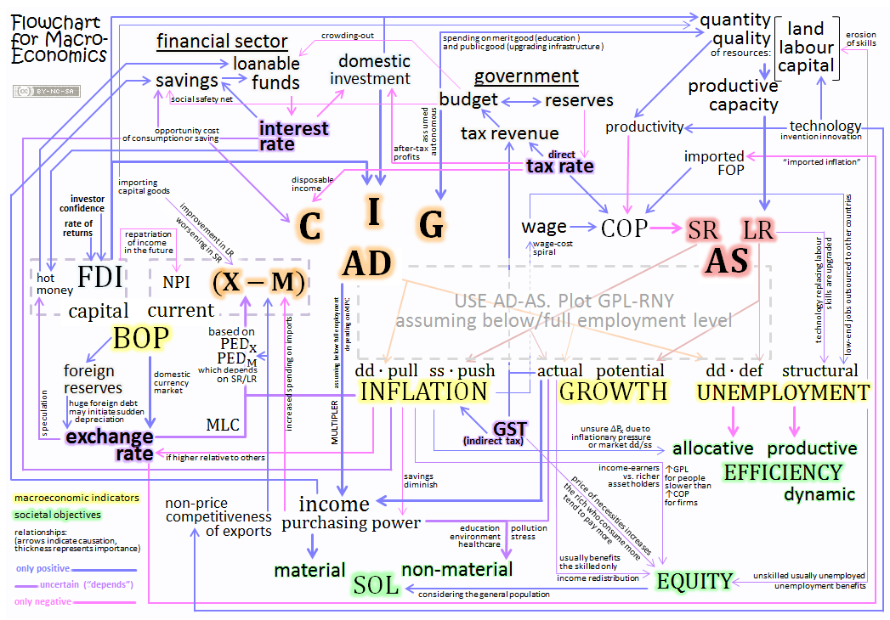

# A-level material

Some of the document are available at [owlcove.sg](https://owlcove.sg/learn) (wow which is still around, praise Jerrold or whoever is maintaining it).

I would have written these in markdown and upload onto Github if I had known technology.

Following are the one-page flowcharts I created for chemistry and economics.

